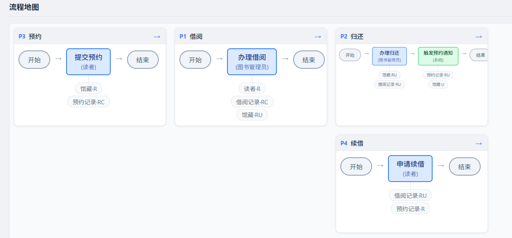
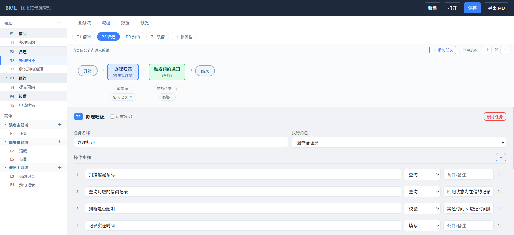
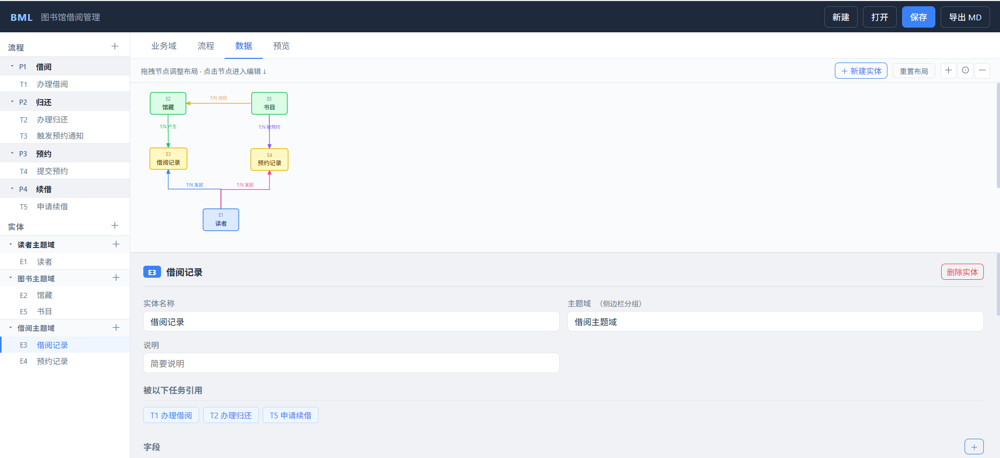
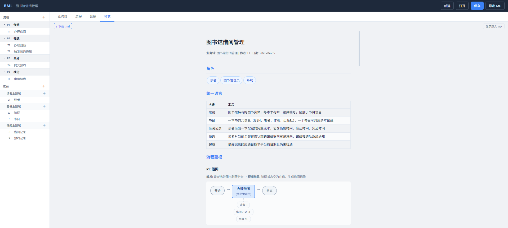

# BLM — 业务语言建模

> **Business Language Modeling**：用结构化的方式记录业务理解，告别 Word + Visio + Typora 反复切换。

---

## 项目结构

```text
blm/
├── blm.py              # 启动入口
├── blm_core/           # 后端核心：文档、存储、导出、HTTP 服务
├── app/                # 前端界面：状态、渲染、领域、流程、实体、预览
├── workspace/          # 本地文档目录（.json / .md）
├── tests/              # Python 单元测试与结构测试
└── tools/
    └── e2e/            # 可选的浏览器端到端测试工具链（Node + Playwright）
```

---

## 产品定位

BLM 是一个**本地优先、文件驱动、可审查的业务语言建模记事本**。

- 轻量简单：运行时尽量只依赖 Python 标准库和静态前端。
- 数据透明：文档直接存为本地 JSON / Markdown，不锁在平台里。
- 结构清晰：代码和数据格式尽量简单，便于理解、排查和二次修改。
- 克制边界：不追求在线协同平台能力，优先把单机建模体验做好。

---

## 什么是"业务结构化"

业务知识通常散落在需求文档、会议记录、口头描述中。BLM 将其收敛为三个核心建模要素：

```text
业务域
├── 流程（Process）          → 业务怎么运转？
│   └── 任务（Task）
│       ├── 步骤（Step）     → 每步执行什么动作？
│       ├── 涉及实体（CRUD） → 读/写了哪些数据？
│       └── 业务规则         → 有哪些约束条件？
│
├── 数据（Data）             → 业务操作什么对象？
│   ├── 实体（Entity）
│   │   └── 字段（Field）
│   └── 实体关系（1:1 / 1:N / N:N）
│
└── 规则（Rule）             → 业务受什么约束？
    ├── 步骤规则（Check / Compute / Mutate 等）
    ├── 任务规则（rules_note）
    └── 数据规则（字段约束 / 实体关系）
```

`角色` 与 `统一语言` 不作为第四核心要素，而是三要素之上的横切视角：

- `角色`：从流程/任务上投影责任视图，回答“谁来执行、谁在使用这些流程模板”。
- `统一语言`：为流程、数据、规则提供统一命名，降低术语歧义。

**与工具中的落点对应如下**：

| 业务语义 | BLM 中的位置 |
|--------|-------------|
| 流程规则（查询 / 校验 / 计算 / 变更） | 任务 → 步骤类型（Query / Check / Compute / Mutate） |
| 业务约束、前置条件、审批条件 | 任务 → `rules_note` |
| 数据规则（字段含义、状态字段、关系约束） | 实体字段 / 实体关系 |
| 责任视角 | 角色词典 + 流程角色视图 |

---

## 快速上手

**运行依赖**：Python 3.8+，无需安装 Node、npm 或额外第三方库

```bash
cd blm
python blm.py          # 启动本地服务，默认 http://127.0.0.1:8888
```

浏览器打开后：新建文档 → 填写业务域信息 → 添加流程和实体 → 导出 MD

---

## 测试说明

Python 测试直接在项目根目录执行：

```bash
python -m unittest discover -s tests -v
```

浏览器端到端测试是**可选工具链**，与运行主路径分离，放在 `tools/e2e/`：

```bash
cd tools/e2e
npm install
npm run install:browser
npm run test:e2e
```

如果想看到浏览器真实打开、慢速点击和输入，可使用演示模式：

```bash
cd tools/e2e
npm run test:e2e:demo
```

---

## 功能演示 · 图书馆借阅管理

以下以「图书馆借阅管理」为例，展示 BLM 的完整建模流程。

### 1. 全局流程地图

卡片式总览所有流程，拖拽调整时序位置（左→右 = 时间顺序，上下 = 并行）。



> 图书馆案例包含 4 个流程：**预约 → 借阅 → 续借 → 归还**，归还后触发预约通知。

---

### 2. 流程建模

每个流程由若干**任务**组成，任务横向排列（直线），点击任务节点编辑详情。



任务详情包含：
- **步骤**：操作类型（查询 / 校验 / 填写 / 计算 / 变更）+ 业务规则说明
- **涉及实体**：该任务对哪些实体做 C/R/U/D
- **业务规则**：文本描述约束条件

借阅流程关键规则：
```
校验是否超期  → 存在超期记录则不允许借阅
校验在借数量  → 普通读者上限 5 本
应还日期计算  → 借出日期 + 30 天（可配置）
```

---

### 3. 数据建模

实体关系图支持**手动拖拽节点**调整布局，关系线自动路由（同行水平 / 跨行 L 形）。



图书馆核心实体：

| 实体 | 主题域 | 说明 |
|------|--------|------|
| 书目 | 图书 | ISBN 级别的书籍元信息 |
| 馆藏 | 图书 | 每本实体书，有唯一条码 |
| 读者 | 读者 | 含账户状态、读者类型 |
| 借阅记录 | 借阅 | 一次借还的完整流水 |
| 预约记录 | 借阅 | 馆藏全部在借时的预登记 |

关系：`书目 1:N 馆藏`，`读者 1:N 借阅记录`，`读者 1:N 预约记录`

---

### 4. 导出预览

点击「预览」标签页，从 JSON 直接渲染为结构化 HTML；点击「下载 .md」导出 Markdown（图形为 Mermaid 格式）。



---

## 让 LLM 自动生成 BLM JSON

这是 README 里最关键的一部分。**BLM 的规范输入输出是 JSON，而不是 Markdown**。  
Markdown、预览、后续原型设计、低代码编排，都是基于 JSON 再派生。

推荐工作流：

1. 给 LLM 一段固定的 system prompt
2. 把需求文档、会议纪要、访谈记录作为 user prompt 输入
3. 明确要求：**只输出合法 JSON，不要解释，不要包 markdown code fence**
4. 生成后直接导入 BLM，再人工补细节

### 推荐 system prompt

```text
你是一名业务建模专家，擅长从需求文档、访谈记录、业务描述中提取结构化的业务模型。
你使用的建模语言是 BLM（Business Language Modeling），输出标准 JSON 格式。

BLM 的核心不是写文章，而是沉淀结构化业务知识。请始终围绕以下原则建模：

1. 核心要素只有三类：
   - 流程（Process）：业务如何运转
   - 数据（Data）：业务操作哪些对象
   - 规则（Rule）：业务受哪些约束

2. 角色不是第四核心要素，而是流程/任务上的责任视角：
   - 角色词典用于统一命名、描述、分类
   - 任务通过 role_id 引用角色

3. 统一语言不是流程节点，而是术语词典：
   - 用于沉淀关键业务名词和定义

4. 输出必须是唯一合法 JSON：
   - 不要输出解释
   - 不要输出 markdown
   - 不要输出 ```json 代码块

5. 如果信息不足：
   - 可以留空字符串
   - 可以省略不确定字段
   - 不要编造业务细节
```

### 推荐 user prompt 模板

```text
请基于以下业务材料，输出一份完整的 BLM JSON。

要求：
1. 流程按“可独立发起、独立跟踪、独立结束”的业务模板划分
2. 任务按“一个角色连续执行、不被其他角色打断”的粒度划分
3. 步骤要写清楚动作，不要只写笼统标题
4. roles 必须输出为对象数组，任务通过 role_id 引用
5. process 必须尽量补充 subDomain，entity 必须补充 group
6. 如果同一角色出现在多个流程中，复用同一个角色对象，不要重复创建
7. 只输出 JSON，不要解释

业务材料如下：
{{在这里粘贴需求文档/访谈纪要/业务描述}}
```

### 推荐 JSON 结构

下面这份结构就是当前 BLM 更推荐的导入格式。`roles` 已升级为对象数组，任务优先通过 `role_id` 关联：

```json
{
  "meta": {
    "domain": "业务域名称",
    "title": "文档标题",
    "author": "作者",
    "date": "YYYY-MM"
  },
  "roles": [
    {
      "id": "R1",
      "name": "仓库管理员",
      "desc": "负责仓库日常监管配置、账号管理和业务统筹。",
      "group": "仓库作业方",
      "subDomains": ["交割服务机构管理", "仓储仓单管理"]
    }
  ],
  "language": [
    { "term": "现货仓单", "definition": "仓库对已入库货物出具的现货凭证。" }
  ],
  "processes": [
    {
      "id": "P1",
      "name": "入库办理",
      "subDomain": "仓储仓单管理",
      "trigger": "预约通过且货物到库",
      "outcome": "完成入库并生成现货仓单",
      "tasks": [
        {
          "id": "T1",
          "name": "确认到货",
          "role_id": "R1",
          "role": "仓库管理员",
          "repeatable": false,
          "steps": [
            {
              "name": "核对到货车辆与预约单",
              "type": "Check",
              "note": "车牌、货主、品种、数量需与预约信息一致"
            },
            {
              "name": "登记到货批次信息",
              "type": "Fill",
              "note": "记录车船号、批次号、到货时间"
            }
          ],
          "entity_ops": [
            { "entity_id": "E1", "ops": ["R", "U"] }
          ],
          "rules_note": "预约未通过或仓容不足时不得办理入库。"
        }
      ]
    }
  ],
  "entities": [
    {
      "id": "E1",
      "name": "入库预约",
      "group": "仓储仓单管理主题域",
      "note": "记录预约发起、审核和时段安排信息。",
      "fields": [
        { "name": "预约编号", "type": "id", "is_key": true, "is_status": false, "note": "" },
        { "name": "预约状态", "type": "enum", "is_key": false, "is_status": true, "note": "待审核/已通过/已拒绝/已撤销" }
      ]
    }
  ],
  "relations": [
    { "from": "E1", "to": "E2", "type": "1:N", "label": "预约生成入库流水" }
  ],
  "rules": [
    {
      "name": "预约状态流转规则",
      "type": "DataRule",
      "applies_to": "E1",
      "description": "待审核预约只能流转到已通过、已拒绝或已撤销。",
      "formula": ""
    }
  ]
}
```

### 生成质量检查清单

把这段再附在 prompt 末尾，通常能让结果更稳：

```text
请在输出前自行检查：
1. 所有流程、任务、实体 ID 是否唯一
2. tasks.role_id 是否都能在 roles 中找到
3. process.subDomain、entity.group 是否尽量补齐
4. steps.type 是否只使用 Query / Check / Fill / Select / Compute / Mutate 或明确的自定义类型
5. entity_ops.entity_id 是否都能在 entities 中找到
6. 不要把页面按钮、技术表、日志表当成业务实体
7. 不要输出注释，不要输出解释，只输出 JSON
```

### 建模注意事项

1. ID 命名：流程用 `P1/P2...`，任务用 `T1/T2...`（全局不重复），实体用 `E1/E2...`，角色用 `R1/R2...`
2. 流程粒度：一个流程 = 一个可独立发起、独立跟踪、独立结束的业务模板
3. 任务粒度：一个任务 = 一个角色连续执行、不被其他角色打断的工作
4. 步骤粒度：一步 = 一个明确动作，最好能直接支撑原型和低代码编排
5. 实体粒度：只建模业务核心实体，不把配置表、日志表、缓存表塞进去
6. 角色粒度：优先统一命名，不要同时出现“仓库业务员 / 业务操作员 / 经办人”这种近义重复
7. 不确定的信息：留空，不编造

---

## 后续规划

```
BLM（本工具）
    ↓ 导出 JSON
DDD_Agent（大模型 + 建模规则）
    → 生成限界上下文、聚合、领域事件
    ↓
BDD_Agent（大模型 + 测试规则）
    → 生成 Gherkin 场景、验收测试
```
