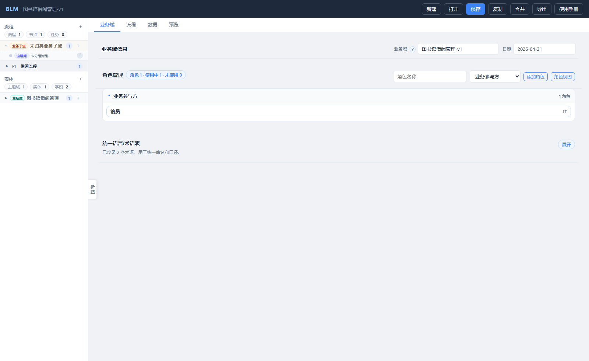
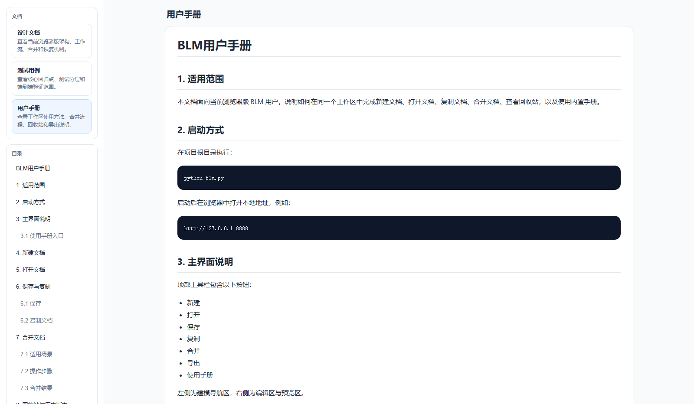
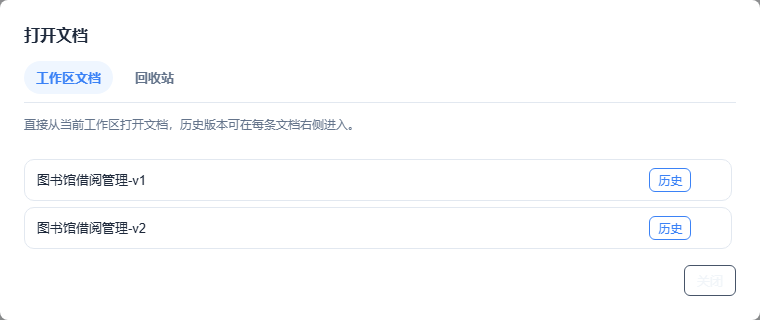
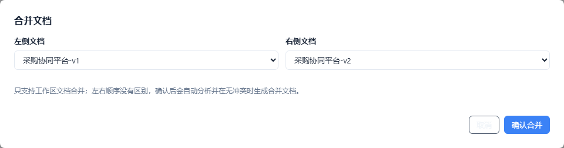
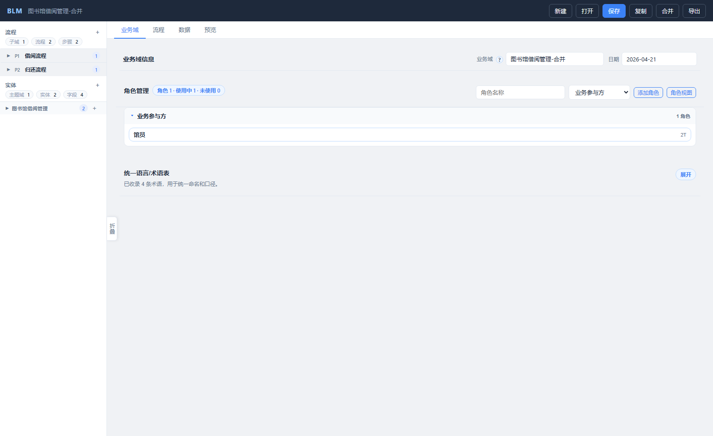

# BLM用户手册

## 1. 适用范围

本文档面向当前浏览器版 BLM 用户，说明如何在同一个工作区中完成文档建模、保存、复制、合并、恢复，以及查看内置使用手册。

## 2. 启动方式

在项目根目录执行：

```bash
python blm.py
```

启动后在浏览器中打开本地地址，例如：

```text
http://127.0.0.1:8888
```

## 3. 主界面说明

顶部工具栏包含以下按钮：

- 新建
- 打开
- 保存
- 复制
- 合并
- 导出
- 使用手册

左侧为工作区导航，右侧为建模编辑区与预览区。



### 3.1 左侧目录怎么看

流程区顶部会展示三个统计口径：

- 流程：当前文档里的流程数量
- 节点：所有流程下的节点数量
- 任务：所有节点下的编排任务数量

其中“任务”默认指编排任务，用来体现研发实现工作量；用户操作步骤不纳入这里的统计。

### 3.2 使用手册入口

1. 点击顶部工具栏里“导出”后面的“使用手册”按钮。
2. 页面会直接打开内置的用户手册。
3. 左侧目录按一级标题分组展示，二级目录默认折叠，点击可展开阅读。
4. 点击目录项后，正文会自动滚动到对应位置。

补充说明：

- 使用手册是独立阅读态，不显示“业务域 / 流程 / 数据 / 预览”这排建模页签。
- 左侧只保留目录，不再显示多文档切换列表。
- 正文中的截图会和文档内容一起渲染。



## 4. 工作区文档操作

### 4.1 新建文档

1. 点击“新建”。
2. 输入文档名称。
3. 点击“创建”。

创建后系统会在当前工作区生成文档，并自动进入编辑状态。

### 4.2 打开文档

1. 点击“打开”。
2. 在“工作区文档”页签中选择目标文档。
3. 点击文档条目即可打开。

打开弹窗包含两个页签：

- 工作区文档
- 回收站

在工作区列表中，每个文档条目右侧还提供：

- 历史：查看该文档的历史快照
- 删除：将文档放入回收站



### 4.3 保存

- 点击“保存”会保存当前文档。
- 如果业务域名称被修改，系统会按新的名称保存工作区文档。
- 若目标名称已存在，会提示是否覆盖同名文档。

### 4.4 复制

“复制文档”用于基于当前内容创建一个新的工作区文档。

1. 点击“复制”。
2. 输入一个新的文档名称。
3. 点击“确认复制”。

复制不是“另存到其他目录”，而是在当前工作区复制出一个新文档，因此复制名称必须唯一。

## 5. 流程建模

### 5.1 流程层级

BLM 当前的流程层级为：

- 业务子域
- 流程组
- 流程

如果一个业务子域下面有很多细粒度流程，例如“新增仓库”“修改仓库”“禁用仓库”，建议通过“流程组”再做一层归类。

### 5.2 节点、用户操作步骤、编排任务

流程内部的主要建模对象包括：

- 节点：业务级的关键处理单元
- 用户操作步骤：面向产品和业务人员，描述页面上的查看、点击、填写、提交等动作
- 编排任务：面向研发人员，描述查询、校验、计算、服务调用、数据变更等实现任务

用户操作步骤与编排任务是两个平行视角，不要求一一对应。

### 5.3 节点编辑

进入节点后，页面会展示：

- 节点基本信息
- 用户步骤视图 / 任务级视图切换
- 用户操作步骤
- 编排任务
- 涉及实体
- 业务规则

其中：

- 产品经理通常重点维护“节点”和“用户操作步骤”
- 研发人员通常重点维护“编排任务”

### 5.4 用户操作步骤

用户操作步骤支持：

- 在任一步骤后直接插入新步骤
- 上移、下移调整顺序
- 为每一步设置类型和备注

这样即使步骤很多，也不需要每次都滚到顶部再新增。

### 5.5 编排任务

编排任务不再使用三级抽屉，而是在当前节点编辑区内直接维护。  
每个编排任务支持：

- 维护名称、类型、目标
- 查询类任务设置查询来源
- 记录输入输出、前置条件和异常处理备注
- 行内插入、上下调整顺序、删除

同时页面会展示“任务级流程图”：

- 多个编排任务按串行顺序排列
- 外层用节点框表示当前节点上下文
- 便于研发从节点视角继续下钻到实现视角

## 6. 合并文档

### 6.1 适用场景

适合两个人在同一工作区里分别维护两个文档，定期把它们合成一个新文档。

### 6.2 操作步骤

1. 点击“合并”。
2. 在左侧文档、右侧文档两个下拉框中选择要合并的工作区文档。
3. 点击“确认合并”。

系统行为如下：

- 如果没有冲突，会直接生成一个新的合并文档。
- 如果存在冲突，会先展示冲突项。
- 处理完所有冲突后，再次点击“确认合并”即可完成。



### 6.3 合并结果

- 合并结果默认以新文档形式保存到工作区。
- 合并后的文档标题与业务域名称会保持一致。



## 7. 回收站与历史版本

### 7.1 历史版本

- 每次覆盖保存前，系统会自动保留旧版本快照。
- 点击“打开”后，在工作区文档条目的“历史”按钮中查看。
- 恢复历史版本前，系统会先为当前版本再保留一个快照。

### 7.2 回收站

- 删除文档时不会直接物理删除，而是进入回收站。
- 点击“打开”，切换到“回收站”页签可查看。
- 点击“恢复”后，文档会回到工作区。

## 8. 导出

点击“导出”后，系统会导出两类文件：

- 当前文档 JSON
- 当前文档 Markdown

其中 Markdown 内容来自当前文档结构化数据的派生结果。

## 9. 常见问题

### 9.1 点击“合并”没有反应怎么办？

- 先刷新页面，确保浏览器拿到最新前端代码。
- 确认工作区中至少存在两个文档。
- 如果仍有问题，查看浏览器控制台是否有前端报错。

### 9.2 使用手册没有加载出来怎么办？

- 如果进入“使用手册”后看到“当前服务版本过旧，请重启 BLM 服务”的提示，通常表示浏览器页面已经更新，但本地 Python 服务还是旧版本。
- 关闭旧的 `blm.py` 进程后重新启动，再刷新浏览器页面即可。

### 9.3 为什么删除后文档还能找回？

因为系统默认启用了回收站，删除操作是“移入回收站”，不是直接彻底删除。

### 9.4 为什么保存前旧内容还能恢复？

因为系统会在覆盖保存前自动生成历史快照，用于误改、误覆盖后的恢复。
