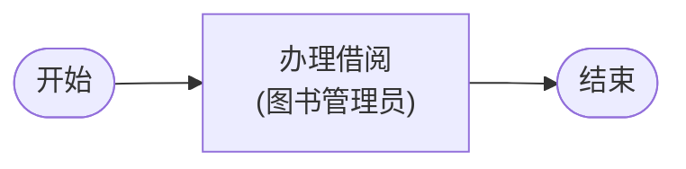
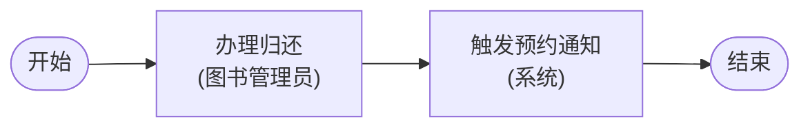
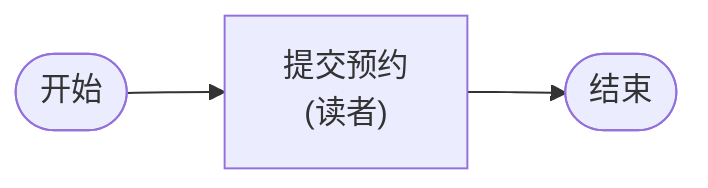
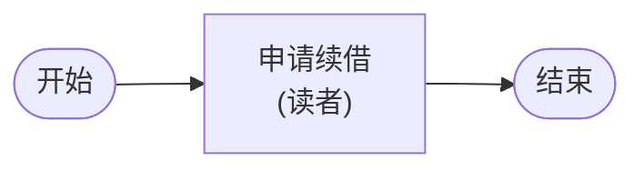
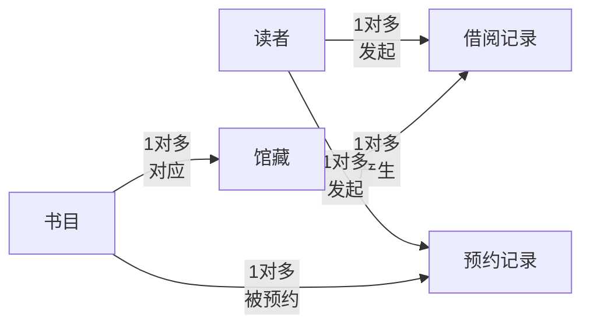

# 图书馆借阅管理

**业务域**: 图书馆借阅管理 | **作者**: LJ | **日期**: 2026-04-05

---

## 一、角色

| 角色 |
|------|
| 读者 |
| 图书管理员 |
| 系统 |

---

## 二、统一语言

| 术语 | 定义 |
|------|------|
| 馆藏 | 图书馆持有的图书实体，每本书有唯一馆藏编号，区别于书目信息 |
| 书目 | 一本书的元信息（ISBN、书名、作者、出版社），一个书目可对应多本馆藏 |
| 借阅记录 | 读者借出一本馆藏的完整流水，包含借出时间、应还时间、实还时间 |
| 预约 | 读者对当前全部在借状态的馆藏提前登记意向，馆藏归还后系统通知 |
| 超期 | 借阅记录的应还日期早于当前日期且尚未归还 |

---

## 三、流程建模

### P1: 借阅

**触发**: 读者携带图书到服务台  →  **预期结果**: 馆藏状态变为在借，生成借阅记录

#### T1. 办理借阅（角色：图书管理员）

| # | 步骤 | 类型 | 条件/备注 |
|---|------|------|----------|
| 1 | 查询读者账户状态 | 查询 | 读者账户必须为正常状态 |
| 2 | 校验是否有超期未还 | Validate | 存在超期记录则不允许借阅 |
| 3 | 校验在借数量是否达上限 | Validate | 默认上限5本，特殊读者类型另设 |
| 4 | 扫描馆藏条码 | 查询 |  |
| 5 | 校验馆藏状态为可借 | Validate | 在借、预约锁定、下架状态不可借出 |
| 6 | 计算应还日期 | Calculate | 借出日期 + 借期天数（默认30天） |
| 7 | 生成借阅记录 | Change | 记录读者ID、馆藏ID、借出时间、应还时间 |
| 8 | 变更馆藏状态为在借 | Change |  |

**涉及实体**: 读者（R）, 借阅记录（R,C）, 馆藏（R,U）

### P2: 归还

**触发**: 读者携带图书到服务台  →  **预期结果**: 馆藏状态恢复可借或触发预约通知

#### T2. 办理归还（角色：图书管理员）

| # | 步骤 | 类型 | 条件/备注 |
|---|------|------|----------|
| 1 | 扫描馆藏条码 | 查询 |  |
| 2 | 查询对应的借阅记录 | 查询 | 匹配状态为在借的记录 |
| 3 | 判断是否超期 | 校验 | 实还时间 > 应还时间则标记超期 |
| 4 | 记录实还时间 | 填写 |  |
| 5 | 更新借阅记录状态为已还 | 变更 |  |
| 6 | 变更馆藏状态为可借 | 变更 |  |

**涉及实体**: 馆藏（R,U）, 借阅记录（R,U）

#### T3. 触发预约通知（角色：系统）

| # | 步骤 | 类型 | 条件/备注 |
|---|------|------|----------|
| 1 | 查询该书目是否有待通知预约 | 查询 | 按预约时间升序取第一条 |
| 2 | 发送通知给预约读者 | Change | 通知方式：站内消息 |
| 3 | 更新预约状态为已通知 | Change | 馆藏进入预约锁定状态，锁定期3天 |

**涉及实体**: 预约记录（R,U）, 馆藏（U）

### P3: 预约

**触发**: 读者查询书目后发现全部馆藏在借  →  **预期结果**: 生成预约记录，等待馆藏归还后通知

#### T4. 提交预约（角色：读者）

| # | 步骤 | 类型 | 条件/备注 |
|---|------|------|----------|
| 1 | 查询书目及馆藏状态 | 查询 | 确认无可借馆藏 |
| 2 | 校验读者是否已预约同一书目 | Validate | 同一书目不允许重复预约 |
| 3 | 生成预约记录 | Change | 记录读者ID、书目ID、预约时间，状态为待通知 |

**涉及实体**: 馆藏（R）, 预约记录（R,C）

### P4: 续借

**触发**: 读者在借阅到期前主动申请延长借期  →  **预期结果**: 应还日期顺延，借阅记录更新

#### T5. 申请续借（角色：读者）

| # | 步骤 | 类型 | 条件/备注 |
|---|------|------|----------|
| 1 | 查询当前借阅记录 | 查询 |  |
| 2 | 校验是否超期 | Validate | 超期状态不允许续借 |
| 3 | 校验续借次数 | Validate | 同一借阅记录最多续借1次 |
| 4 | 校验该馆藏是否有预约 | Validate | 有待通知预约时不允许续借 |
| 5 | 更新应还日期 | Change | 在原应还日期基础上顺延30天 |
| 6 | 记录续借次数+1 | Change |  |

**涉及实体**: 借阅记录（R,U）, 预约记录（R）

---

## 四、数据建模

### 实体：读者

| 字段 | 类型 | 主键 | 状态字段 | 公式/约束 |
|------|------|------|---------|---------|
| 读者ID | String |  |  | 系统生成 |
| 姓名 | String |  |  |  |
| 账户状态 | Enum |  |  | 正常 / 冻结 |
| 读者类型 | Enum |  |  | 普通 / 学生 / 教师，决定借期和上限 |
| 最大在借数量 | Int |  |  | 由读者类型决定，默认5 |

### 实体：馆藏

| 字段 | 类型 | 主键 | 状态字段 | 公式/约束 |
|------|------|------|---------|---------|
| 馆藏ID | String |  |  | 条码扫描值 |
| 书目ID | String |  |  | 外键，关联书目 |
| 馆藏状态 | Enum |  |  | 可借 / 在借 / 预约锁定 / 下架 |
| 存放位置 | String |  |  | 区号-架号-层号 |

### 实体：借阅记录

| 字段 | 类型 | 主键 | 状态字段 | 公式/约束 |
|------|------|------|---------|---------|
| 借阅ID | String |  |  | 系统生成 |
| 读者ID | String |  |  | 外键 |
| 馆藏ID | String |  |  | 外键 |
| 借出时间 | DateTime |  |  |  |
| 应还时间 | DateTime |  |  | 借出时间 + 借期天数 |
| 实还时间 | DateTime |  |  | 归还时填写，未还时为空 |
| 借阅状态 | Enum |  |  | 在借 / 已还 / 超期 |
| 续借次数 | Int |  |  | 最大值1 |

### 实体：预约记录

| 字段 | 类型 | 主键 | 状态字段 | 公式/约束 |
|------|------|------|---------|---------|
| 预约ID | String |  |  | 系统生成 |
| 读者ID | String |  |  | 外键 |
| 书目ID | String |  |  | 外键，预约到书目级别 |
| 预约时间 | DateTime |  |  | 用于排队顺序 |
| 预约状态 | Enum |  |  | 待通知 / 已通知 / 已取书 / 已取消 |
| 通知时间 | DateTime |  |  | 发出通知的时间，未通知时为空 |
| 锁定截止时间 | DateTime |  |  | 已通知后锁定3天，超时自动释放 |

### 实体：书目

| 字段 | 类型 | 主键 | 状态字段 | 公式/约束 |
|------|------|------|---------|---------|
| 书目ID | String |  |  | ISBN |
| 书名 | String |  |  |  |
| 作者 | String |  |  |  |
| 出版社 | String |  |  |  |

---

## 五、规则建模

| 规则名 | 类型 | 绑定对象 | 描述 | 公式 |
|--------|------|---------|------|------|
| 超期读者不可借阅 |  |  | 读者存在任意一条超期未还的借阅记录时，不允许新的借阅操作 |  |
| 在借上限约束 |  |  | 读者当前在借数量达到最大在借数量时，不允许新的借阅操作 |  |
| 续借次数上限 |  |  | 同一借阅记录最多续借1次 |  |
| 有预约不可续借 |  |  | 馆藏对应书目存在待通知状态的预约时，不允许当前借阅人续借 |  |
| 预约锁定期 |  |  | 馆藏归还后通知预约读者，锁定期3天；超过3天未取书，自动释放馆藏并通知下一位预约人 |  |
| 同书目不可重复预约 |  |  | 读者对同一书目只能有一条待通知或已通知状态的预约 |  |
